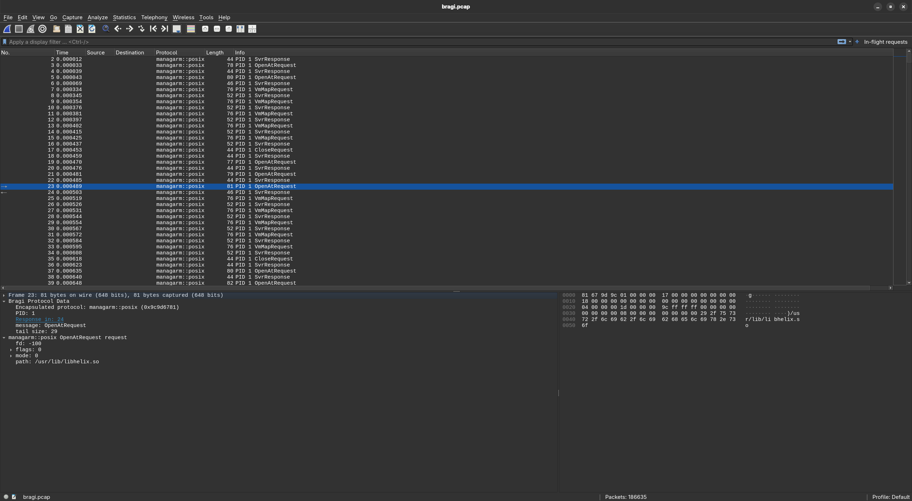

# Using Wireshark to dissect bragi messages

Managarm offers the possibility of dumping some protocols for inspection with Wireshark.



## Setting it up

Bragi can generate the Wireshark dissector with a command like:

```sh
bragi -o bragi.lua ../src/managarm/protocols/posix/posix.bragi ../src/managarm/protocols/fs/fs.bragi wireshark
```

This command is the currently recommended way, as other protocols are currently not dumped. This generates the Wireshark Lua dissector at `bragi.lua`, which needs to be placed under `~/.local/lib/wireshark/plugins/`, either by copying the file or symlinking. Make sure that your Wireshark has Lua dissector support enabled. The bragi dissector should be rebuilt after every change to one of the passed bragi protocols. Reloading the Lua file in Wireshark can then be done with `Ctrl+Shift+L`.

Dumps are collected over ostrace if it has been enabled with the `ostrace` kernel cmdline. This will generate a `ostrace.bin` in your build directory. A Wireshark-usable pcap file can then be generated with the following command:

```sh
xbstrap run generate-pcap
```

This will result in a `bragi.pcap` file that can be opened with Wireshark.

## Analyzing the dump with Wireshark

All packets in the pcap include a header that contains some metadata about the bragi message. The details of that can be seen under the `Bragi Protocol Data` foldable section in the dissector window. Below that, protocol-specific decoding of the messages follows.

For diagnosing hangs, it can be useful to get a view of all in-flight requests. For convenience, this can be roughly filtered with the following expression:

```
!bragi.reply_to && !bragi.request_of && !fs_ioctlrequest && !fs_initializeposixlane && !posix_netserverrequest
```

This can be saved as a filter, as can be seen in the screenshot above.
